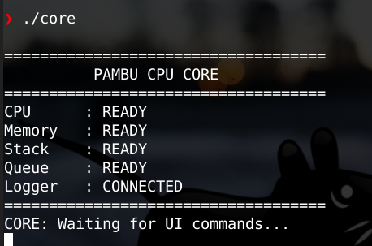
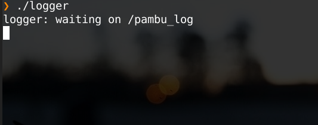
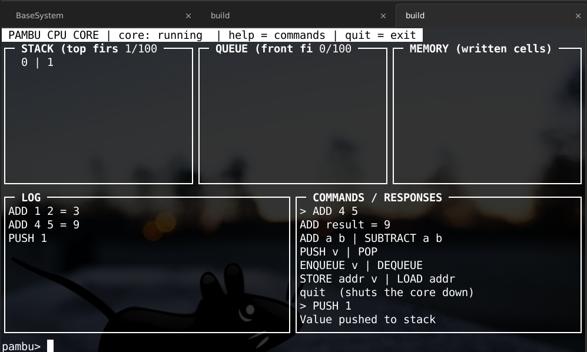

# pambu

A PBL project implementing a multi-process CPU emulator with a message-queue based architecture.

## Team

- Madiha
- Falah
- Misba
- Ruben
- Chris

## Demo

**CPU Core**

**Logger**

**User Interface**

## Week 2 Status

- Core CPU process emulation
- Logger process listening for messages from the *core*
- UI communicating with the *core* process
- Test files and documentation
